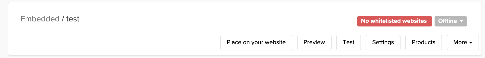

# FastSpringStore

Interfaces with FastSpring Embedded Storefrontsto offer secure in-app purchase windows.

> [!TIP]
> For setup instructions of your own store and app preparation with FastSpring, take a look at my book [_Make Money Outside the Mac App Store_](https://christiantietze.de/books/make-money-outside-mac-app-store-fastspring/).

**Works exceptionally well with my [Trial & Licensing package](https://github.com/CleanCocoa/TrialLicensing)** that's based on CocoaFob for license code generation.

[Embedded Storefront]: https://developer.fastspring.com/docs/building-and-adding-an-embedded-storefront-to-your-website

## Installation

### Swift Package Manager

```swift
dependencies: [
  .package(url: "https://github.com/CleanCocoa/FastSpringStore.git", .upToNextMajor(from: Version(1, 0, 0))),
]
```

Add package depencency via Xcode by using this URL: `https://github.com/CleanCocoa/FastSpringStore.git`

## Usage

The process requires two pieces:

1. Online store, using FastSpring's [Embedded Storefront][], and
2. This package to display the store and tell your app about purchases.

### Embedded Storefront Setup

**If you already have an Embedded Storefront, you can skip this step.**

Embedded Storefronts are a minimal version of the store UI. They only show the checkout details, nothing more.

To setup the store:

1. Log into the [FastSpring Dashboard](https://app.fastspring.com/),
2. navigate to _Storefronts ▶ Embedded Storefronts_,
3. "Create Embedded Storefront" and pick a unique ID for the storefront.



Note that the new storefront starts with:

- "Offline" mode, so it's only available for testing;
- "No whitelisted websites", so you can't embed it anywhere, yet;
- No products in the storefront, so you can't offer anything, yet.

I suggest starting with "Products": add the app you want to sell to the store.

Then "whitelist" your website so you can put the Embedded Store online in the next step.

#### Storefront HTML

You can start with the template from the "Place On Your Website" action of your Embedded Store, then

- set the `data-popup-webhook-received="fsprg_dataPopupWebhookReceived"` attribute to the script, and
- add the product to the store's cart.

This is the result, with placeholders in all caps:

```html
<script
  id="fsc-api"
  src="https://sbl.onfastspring.com/sbl/0.9.6/fastspring-builder.min.js"
  type="text/javascript"
  data-storefront="STOREFRONT-ID"
  data-popup-webhook-received="fsprg_dataPopupWebhookReceived"></script>
<div id="fsc-embedded-checkout-container"></div>
<script>fastspring.builder.add("PRODUCT-ID");</script>
```

That's all the HTML you really need.

Replace the placeholders `PRODUCT-ID` and `STOREFRONT-ID`, then upload this to your whitelisted domain.

In "Offline" mode, the `STOREFRONT-ID` will include "`test.onfastspring`" in the subdomain part of the URL (e.g. `yourstore.test.onfastspring.com/embedded-test`). You can't access the regular one while in "Offline" mode, but after you switch the Embedded Store to "Online", you can use both. We'll make use of that for debugging.

When the storefront is displayed in your app, [this package will inject][inject] the callback `fsprg_dataPopupWebhookReceived` into the web view to handle purchases. You don't need to implement any JavaScript here.

> [!TIP]
> I suggest uploading two versions of this template:
>
> 1. The live store used in production, e.g. at `myapp.com/embedded-store`
> 2. The test store used internally for `DEBUG` builds, e.g. at `myapp.com/embedded-store/test`.
>
> This way, you can test the checkout process with FastSpring's placeholder credit cards details. The test store includes a prominent badge at the top. Clicking it reveals how you can place test purchases:
>
> 

[inject]: https://github.com/CleanCocoa/FastSpringStore/blob/5a70b488a72c623bb85b703c8c3533f67125c57d/Sources/FastSpringStore/FastSpringStoreJavaScriptBridge.swift#L55

#### Verify Your Embedded Store Setup

Check that the Embedded Store works. Access the HTML file you prepared in your web browser.

If it works in the browser, it'll work in the app.

So once you see a checkout form to make purchases, you're good to go. We'll embed that in the app next.

> [!WARNING]
> 
>
> Do you just see placeholder loading animations?
>
> - Make sure you're using the `test` URL while in "Offline" mode,
> - or switch to "Online" before accessing the store for production.
> - Ensure a product is added to the cart, otherwise the store won't load:
>     ```html
>     <script>fastspring.builder.add("PRODUCT-ID");</script>
>     ```

### Using the Embedded Storefront in Your App

Import this packagage into your project. Then use `FastSpringStore` to access your Embedded Storefront HTML.

The following code example ties together

- setting up your Embedded Storefront URLs,
- initializing the `FastSpringStore` UI to display the Embedded Store, and finally
- unlocks app functionality after a purchase.

```swift
#if DEBUG
// Test store that accepts credit card placeholder values:
private let storeURL = URL(string: "https://myapp.com/embedded-store/test")!
#else
private let storeURL = URL(string: "https://myapp.com/embedded-store")!
#endif

class PurchaseLicense {
    let store: FastSpringStore

    init() {
        self.store = FastSpringStore(
            storeURL: storeURL,
            purchaseCallback: { store, purchases in
                // Could have multiple purchased items, e.g. if you
                // offer in-app purchases of bundled features.
                assert(purchases.count == 1)
                guard let purchase = purchases.first else { return }

                for license in purchase.licenses {
                    // Unlock via license.licenseName & license.licenseCode, e.g.
                    // using the https://github.com/CleanCocoa/TrialLicensing package:
                    //
                    //   TrialLicensing.AppLicensing.register(
                    //       name: license.licenseName,
                    //       licenseCode: license.licenseCode
                    //   )
                }
            })
    }

    func showStore() {
        // Localize and customize the window title:
        store.showStore(title: "Purchase MyApp")
    }
}
```

Add this to your app, e.g. by abusing the popular _Put Everything Into the AppDelegate_ Anti-Pattern:

```swift
// AppDelegate.swift
@NSApplicationMain
class AppDelegate: NSObject, NSApplicationDelegate {
    // ...

    lazy var purchaseLicense = PurchaseLicense()

    @IBAction func buyApp(_ sender: Any?) {
        purchaseLicense.showStore()
    }

    // ...
}
```

When you call `showStore()`, you should see a small window appear that displays your Embedded Storefront similar to how the web browser does.

> [!WARNING]
> 
>
> If you just see placeholder loading animations, verify that you can access the URL in your web browser, first.
>
> Then check that you are using the correct store URL, e.g. the `test.onfastspring` subdomain in `DEBUG` builds, or the live URL for production, and that your Embedded Store is actually "Online".

## Preparing to Ship

Go through the checkout flow with the test store to verify that the purchase works and that your app is being unlocked successfully.

The switch from "debug" to "release" is to replace the `test.onfastspring` subdomain with `onfastspring` in the Embedded Store HTML. The rest of the setup doesn't change. If you followed my advice, you have two HTML files for this anyway, so you do not need to change the HTML files, only the store URLs.

1. Change the Embedded Store's state in the FastSpring Dashboard from "Offline" to "Online" if you haven't already.
2. Verify that the Embedded Store can be accessed from the browser.
3. Verify that the Embedded Store doesn't show the "Test Mode" badge at the top anymore.
   
4. Double-check that the `data-popup-webhook-received` attribute is set properly. Otherwise, your store will work nicely, but your app won't unlock automatically.

So when you make a release build, **make sure to test that automatic unlocking still works** at least once. I suggest setting up a 100% discount coupon for this so you don't incur any purchase fees.

## Architecture

This package doesn't have a lot going on in terms of architecture, but here are the most important parts:

- [`FastSpringStore`](https://github.com/CleanCocoa/FastSpringStore/blob/main/Sources/FastSpringStore/FastSpringStore.swift) is your **entry point**. It manages the store window and forwards purchase callbacks.

    Simplified, the API is:
    ```swift
    class FastSpringStore {
        init(
            storeURL: URL,
            purchaseCallback: @escaping (FastSpringStore, [FastSpringPurchase]) -> Void
        )
        func showStore(title: String)
        func closeWindow()
    }
    ```

- [`FastSpringPurchase`](https://github.com/CleanCocoa/FastSpringStore/blob/main/Sources/FastSpringStore/FastSpringPurchase.swift) is the payload (_Data-Transfer Object_) that contains all information of a successful purchase. You can offer multiple products in a store, and bundles, too. So you will get an array of purchases and each purchase can contain multiple `License`s.

    Simplified:
    ```swift
    struct FastSpringPurchase {
        struct License: Equatable {
            enum LicenseType { case cocoaFob }

            let licenseCode: String
            let licenseName: String
            let licenseType: LicenseType
        }

        let product: String
        let quantity: Int
        let licenses: [License]
    }
    ```

## License

Copyright (c) 2015 by [Christian Tietze](https://christiantietze.de/). Distributed under the MIT License. See the LICENSE file for details.
